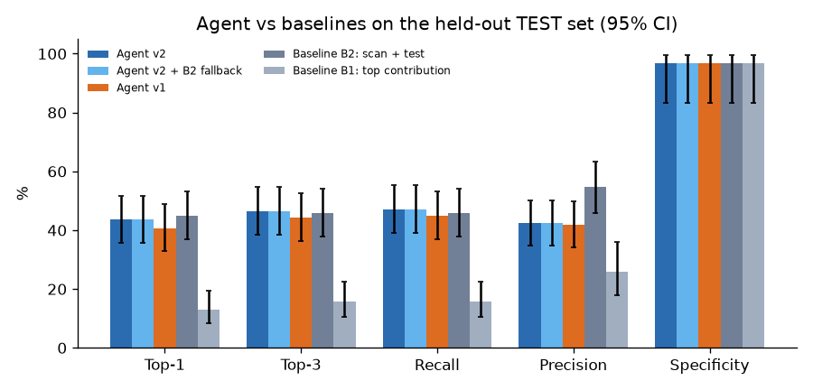
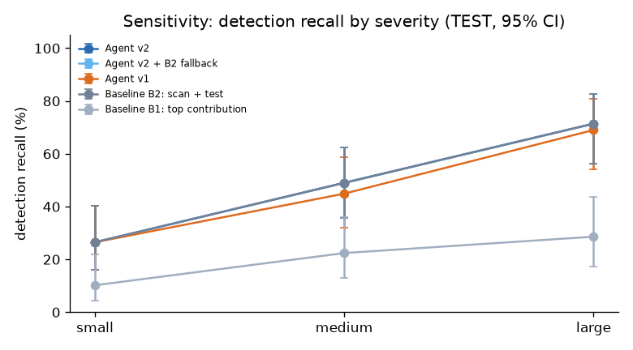
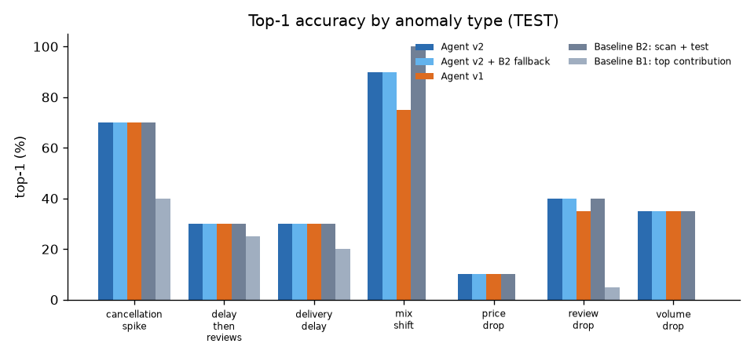
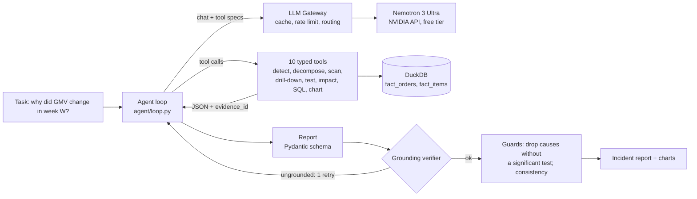

# KPI Root-Cause Agent

An LLM agent that investigates why a business KPI moved: it confirms the anomaly, decomposes the metric, scans every segment, tests significance and writes a short incident report in which every number is checked against a tool output.

**Highlights** (held-out TEST set, 140 planted anomalies + 30 control weeks)

<!-- HIGHLIGHTS:START -->

- **43.6%** top-1 root-cause accuracy (week-clustered 95% CI [36.9, 50.7]); **91.0%** when the anomaly is detected.
- **99.67%** of report figures verified against tool outputs, **0** invented numbers, **96.7%** specificity on control weeks.
- **98.0%** identical top cause on a repeat run (kappa 0.96); **98.5%** gateway cache hits on a rerun.

<!-- HIGHLIGHTS:END -->

[](https://github.com/nivi9944/kpi-rca-agent/actions/workflows/ci.yml)

[](LICENSE)

`LLM function calling` · `Pydantic` · `DuckDB` · `pandas` · `SciPy` / `statsmodels` · `Streamlit` · `pytest`

---

## Overview

When GMV, average order value or on-time delivery moves unexpectedly, an analyst has to find out which
segment caused it, whether the effect is real, and what it is worth. This project hands that investigation to
an LLM agent with a strict division of labour: **the LLM plans and explains, deterministic Python computes.**
The model chooses which of 10 typed tools to call; every figure in its final report must match a cited tool
output or the grounding verifier rejects it; deterministic guards then drop any cause that has no significant
test.

Data: the public [Olist Brazilian e-commerce dataset](https://www.kaggle.com/datasets/olistbr/brazilian-ecommerce),
98,353 orders and 112,279 items over 87 weeks (2017-01-02 to 2018-08-27),
aggregated weekly (`results/data_summary.json`).

**Model:** NVIDIA Nemotron 3 Ultra (`nvidia/nemotron-3-ultra-550b-a55b`, NVIDIA API catalog free tier, thinking
off), called through my [LLM API Gateway](https://github.com/nivi9944/llm-gateway). Chosen because the Gemini free
tier allows only 20 requests per day and Mistral's free API returned a 0 requests/min limit
([DECISIONS.md](DECISIONS.md)).

## Key results (held-out TEST set)

140 planted anomalies (7 types x 20) and 30 control weeks, built with a new seed after
all v2 code was frozen, in 8 target weeks that never overlap the development set. Headline intervals are
**week-clustered bootstrap 95% CIs** (scenarios sharing a week are correlated); Wilson intervals are in
`results/v2/summary.json`.

| Investigator | Top-1 | Top-3 | MRR | Precision | Recall | F1 | Specificity |
|---|---|---|---|---|---|---|---|
| Agent v2 | **43.6%** (61/140) [36.9, 50.7] | 46.4% [39.7, 53.0] | 0.4518 | 42.3% | 47.1% | 44.6 [40.9, 47.7] | 96.7% (29/30) |
| Agent v2 + B2 fallback | **43.6%** (61/140) [36.9, 50.7] | 46.4% [39.7, 53.0] | 0.4518 | 42.3% | 47.1% | 44.6 [40.9, 47.7] | 96.7% (29/30) |
| Agent v1 | **40.7%** (57/140) [33.8, 48.9] | 44.3% [37.2, 51.2] | 0.4264 | 41.7% | 45.0% | 43.3 [38.9, 47.1] | 96.7% (29/30) |
| Baseline B2: scan + test | **45.0%** (63/140) [39.3, 51.5] | 45.7% [39.6, 52.0] | 0.4536 | 54.7% | 45.7% | 49.8 [46.0, 54.1] | 96.7% (29/30) |
| Baseline B1: top contribution | **12.9%** (18/140) [8.0, 17.5] | 15.7% [10.1, 21.0] | 0.1417 | 25.9% | 15.7% | 19.6 [14.5, 23.0] | 96.7% (29/30) |

**Significance** (exact McNemar on paired top-1, `results/v2/mcnemar.json`): v2 vs v1 4 vs 0, p = 0.125;
v2 vs B2 0 vs 2, p = 0.5; v1 vs B2 0 vs 6, p = 0.0312.

**Reading the table honestly.**
- **v2 vs v1:** v2 improves on v1 on unseen scenarios, but the gain is **not statistically significant**.
- **v2 vs B2:** v2 **ties** the strong statistical baseline B2 on accuracy, while B2 has higher precision (the agent sometimes lists extra causes).
- **Fallback:** the B2 fallback never triggered (v2 never left a planted scenario empty while B2 had an answer), so that row equals v2.
- **What the agent adds over B2** is what a rule cannot produce: a readable incident report with business framing, R$ impact and actions, in which 99.67% of the figures are machine-verified.
- **Both far exceed the naive rule (B1).**



### Detection and sensitivity

The binding limit is detection, shared by every investigator that uses the segment scan:
- **73 of 140** planted anomalies are never flagged: the scan threshold is set for a low false-alarm rate.
- **When v2 does detect an anomaly, its top cause is right 91.0% of the time** [81.8, 95.8] (B2: 94.0%).
- **Detection recall by severity** (small / medium / large): v2 26.5% / 49.0% / 71.4%; B2 26.5% / 49.0% / 71.4%; B1 10.2% / 22.4% / 28.6%.



### Accuracy by anomaly type (top-1, out of 20 each)

| Type | Agent v2 | Agent v1 | B2 | B1 |
|---|---|---|---|---|
| cancellation_spike | 14/20 | 14/20 | 14/20 | 8/20 |
| delay_then_reviews | 6/20 | 6/20 | 6/20 | 5/20 |
| delivery_delay | 6/20 | 6/20 | 6/20 | 4/20 |
| mix_shift | 18/20 | 15/20 | 20/20 | 0/20 |
| price_drop | 2/20 | 2/20 | 2/20 | 0/20 |
| review_drop | 8/20 | 7/20 | 8/20 | 1/20 |
| volume_drop | 7/20 | 7/20 | 7/20 | 0/20 |

`delay_then_reviews` is a chained scenario: deliveries of one seller state are delayed in week W and that
state's reviews drop in week W+1 (the investigated week). Full type x severity table: `results/v2/by_type_severity.csv`.



### Grounding, impact, cost, stability and caching

| Investigator | Latency avg / p50 / p95 | Tool calls | Tokens | Grounding | Invented numbers |
|---|---|---|---|---|---|
| Agent v2 | 205.44 s / 194.89 s / 350.19 s | 12.15 | 91659.5 | 99.67% | 0 |
| Agent v1 | 164.41 s / 166.22 s / 264.35 s | 10.14 | 72310.7 | 99.68% | 0 |
| Baseline B2: scan + test | 1.25 s / 1.22 s / 1.97 s | 3.35 | none (no LLM) | n/a | n/a |
| Baseline B1: top contribution | 0.08 s / 0.04 s / 0.3 s | 1.85 | none (no LLM) | n/a | n/a |

- **Ungrounded numbers (v2):** 8 numbers were flagged, **none invented**: 5 were values the model derived from two tool values, 3 were "p < 0.001" threshold notation.
- **Effect label:** the effect label (mix vs rate) was right in 100.0% of the 59 cases where the right segment was named.
- **R$ impact error:** 26.2% MAPE against the true planted impact, over 29 scenarios (v1: 27.6%).
- **Stability:** v2 rerun on 50 random TEST scenarios with the gateway cache bypassed gave the same top cause in **98.0%** [89.5, 99.6], Cohen's kappa 0.96 on correctness (`results/v2/stability.json`).
- **Caching:** a cache rerun of 30 scenarios hit the exact cache on 393 of 399 calls (98.5%); median cache-hit call 0.05 s, average scenario 200.56 s to 39.85 s (`results/v2/cache_rerun.json`).
- **Cost:** $0 actual (free tier).

## Architecture



## How the agent investigates

1. `detect_anomalies`: robust z-score of the week's change vs the previous 4-week average, scored against the 8 trailing weekly changes (median/MAD).
2. `decompose_metric`: GMV = Orders x AOV (exact log split); AOV = items per order x value per item.
3. `scan_segments`: every segment of every dimension against its own weekly history (share and rate), with a sampling-noise floor; also on `avg_item_price` (item-level price) for AOV.
4. `drill_down`: contribution of each segment, with the exact mix vs rate split `delta = sum (w1 - w0)(r0 - R0) [mix] + sum w1 (r1 - r0) [rate]`.
5. `significance_test`: chi-square on share, two-proportion z or Welch t on rate; a cause must pass **Benjamini-Hochberg q <= 0.05 and |hist_z| >= 4.25** (threshold calibrated on 170 natural weeks only, `results/calibration.json`).
6. `estimate_impact` (R$), optional read-only `run_sql` and `make_chart`, then `submit_report`.

The loop is bounded (15 tool calls, token budget, timeout) and runs at temperature 0. The report is validated
against a Pydantic schema, and the model gets one corrective retry if the verifier finds an untraceable number.
Example reports: `results/examples/`.

## Methodology: DEV and held-out TEST

- **DEV:** the original 50 scenarios (40 planted + 10 controls) were used freely to develop v2 (2 rounds). Each change and its evidence is in [DECISIONS.md](DECISIONS.md), including ideas that were **tried and rejected**: evidence-based re-ranking of causes, and a longer price-drop prompt.
- **TEST:** built once, after v2 was frozen and committed, with a new seed: 20 scenarios per type, severities cycling small / medium / large, target weeks disjoint from DEV, segments drawn by rule from the largest segments. Each investigator ran on TEST once. No threshold was recalibrated.
- **A test-set construction error was caught and fixed before any agent result was used.** The first TEST build also used Olist's launch weeks, which have too little history. Even B2 found only 4 of 51 planted causes there (7.8%), so the set was rebuilt with the DEV pool rule and all runs restarted (`results/v2/archive_launch_weeks/`).
- **v1 on TEST** is reproduced exactly with `--agent-version v1` (the v1 prompt verbatim, no new metric, no guards, 12 steps).

DEV results (`results/runs/`, 40 planted):

| Investigator | Top-1 | Top-3 | MRR |
|---|---|---|---|
| Agent v2 | 55.0% (22/40) | 57.5% | 0.5625 |
| Agent v1 | 52.5% (21/40) | 57.5% | 0.5500 |
| B2: scan + test | 52.5% (21/40) | 57.5% | 0.5458 |
| B1: top contribution | 17.5% (7/40) | 20.0% | 0.1833 |

The v2 DEV to TEST gap is 11.4 points of top-1 (55.0% on DEV vs 43.6% on TEST,
`results/v2/dev_test_gap.json`): part is DEV selection, part is that TEST uses mostly new segments and a new
chained type.

## Failure analysis (TEST)

- **Detection is the bottleneck.** 73 of 140 planted anomalies were never flagged by v2 (B2: 73); small severities are mostly below the noise floor of weekly segment data (detection 26.5% for small vs 71.4% for large).
- **Price drops** (2/20 for every investigator): a price cut in one category barely moves AOV, and the category's own price history is noisy. The agent used `avg_item_price` in only a few investigations.
- **Mix shifts:** v2 18/20 vs B2 20/20. In both misses the agent ranked a correlated side effect (a seller state whose share moved with the category) above the true category, which it still listed.
- **Precision:** v2 sometimes lists up to 5 supported causes where one is planted, so its precision (42.3%) is below B2's (54.7%).
- **False alarm:** one noisy control week (2018-04-23, GMV) was flagged by every investigator. The same `watches_gifts` movement appears in the untouched data that week, so it is a real event in a control week (controls are deliberately not filtered).

## Real-world case study

Not part of the score (`results/case_study.json`):

- **2018 Brazilian truckers' strike (week of 2018-05-21):** GMV fell -48.7308% vs the prior 4 weeks (z -25.694); 96.9752% of the drop came from fewer orders, and no single segment passed the tests (a broad shock).
- **Black Friday 2017 (week of 2017-11-20):** GMV rose 165.12%, while the on-time delivery rate fell from 0.9456 to 0.8274.

## Expectations vs results

| Expectation | Result on TEST | Status | Evidence |
|---|---|---|---|
| Numbers only from tools, enforced | 99.67% grounded, 0 invented numbers | Met | `results/v2/summary.json` |
| Beat the naive baseline (B1) | 43.6% vs 12.9% top-1 | Met | `results/v2/summary.json` |
| Beat the statistical baseline (B2) | 43.6% vs 45.0%, McNemar p = 0.5 | Not met (tie) | `results/v2/mcnemar.json` |
| v2 better than v1 | 43.6% vs 40.7%, 4 wins and 0 losses, p = 0.125 | Partly met (not significant) | `results/v2/mcnemar.json` |
| Advantage on mix shifts | v2 18/20 vs B1 0/20, B2 20/20 | Partly met | `results/v2/summary.json` |
| Downstream effects (delay then reviews) | v2 6/20, same as B2 | Not met (no advantage) | `results/v2/summary.json` |
| Say "nothing found" on controls | 96.7% specificity; the one alarm is a real event | Met | `results/v2/summary.json` |
| Readable, business-framed report | narrative, R$ impact (26.2% MAPE), actions | Met | `results/examples/`, `results/v2/summary.json` |
| Reproducible and stable | 98.0% same top cause on repeat, 98.5% cache hits | Met | `results/v2/stability.json`, `results/v2/cache_rerun.json` |

## Design decisions

The main choices are in [DECISIONS.md](DECISIONS.md), each with its reason and, for v2, the DEV evidence. In short:
- an own agent loop with plain OpenAI-style function calling (no framework);
- a Pydantic report schema submitted through a tool;
- median/MAD anomaly scoring against the change history;
- an exact mix vs rate split;
- significance with Benjamini-Hochberg correction, plus a history check calibrated on natural weeks;
- deterministic post-verifier guards;
- every run forced to one provider through the gateway;
- a held-out TEST set built after the code was frozen.

## Run it in 3 commands

```powershell
pip install -r requirements.txt
python -m data.load_olist                  # put the Kaggle zip (or CSVs) in data/raw first
streamlit run app/streamlit_app.py         # demo: pick a scenario or a real week
```

Evaluation:
- `python -m eval.run --model nvidia` runs the DEV set. It needs the gateway with an `NVIDIA_API_KEY`.
- `python -m eval.run_test_phase` runs the TEST set: resumable, with a budget guard and `--workers`.
- `python -m eval.metrics_v2` computes the TEST metrics, and `python -m eval.readme_v2` writes this README.
- Live progress: `python -m eval.progress --watch`.
- Tests: `python -m pytest -q` (synthetic fixture with hand-computed answers; no data or key needed).

## Project structure

| Folder | What it holds |
|---|---|
| `data/` | CSV to DuckDB build: `fact_orders`, `fact_items` |
| `metrics/` | Metric catalog (each metric defined once, incl. `avg_item_price`) and the metric engine |
| `tools/` | Analysis tools, SQL guard, charts, tool registry (typed schemas) |
| `inject/` | Anomaly injector, DEV manifest (`manifest.json`) and held-out TEST manifest (`manifest_test.json`) |
| `agent/` | Loop, prompts, report schema, grounding verifier, guards, compact tool view, LLM client |
| `baseline/` | Two deterministic baselines |
| `eval/` | Runner (workers, resume), TEST orchestrator, metrics (bootstrap, McNemar), progress window, README |
| `app/` | Streamlit demo |
| `results/` | Every reported number: DEV (`results/`), TEST (`results/v2/`), run logs with full evidence |
| `tests/` | Unit tests for tools, verifier, guards, SQL guard, scoring, metrics, workers and the agent loop |

## Limitations and future work

- **Only 8 TEST weeks.** To stay disjoint from DEV, the TEST set uses only 8 target weeks, so scenarios are correlated within a week and the week-clustered intervals are wide.
- **Launch weeks are out of scope.** Scenarios in Olist's launch weeks (thin history, tiny segments) are undetectable even for B2: 4 of 51 (7.8%) in the discarded first TEST build.
- **Anomalies are synthetic:** clean, single-cause, one-week events planted into real data. Olist has no traffic data (no conversion funnel), one currency (R$) and weekly grain only.
- **Detection trades recall for a low false-alarm rate;** small effects are mostly missed.
- **The agent does not beat B2 on accuracy.** Next: rank candidates by their share of the KPI change, not only their unusualness, and add scenario types where reasoning across metrics should matter more.
- **Throughput:** the model runs on a free tier with a per-model rate limit (about 5 calls/min for Ultra on our key), so a full TEST run takes most of a day.

## Licence

Code: MIT. Data: Olist, CC BY-NC-SA 4.0 (non-commercial); this repository contains code and results only,
download the data from Kaggle.
