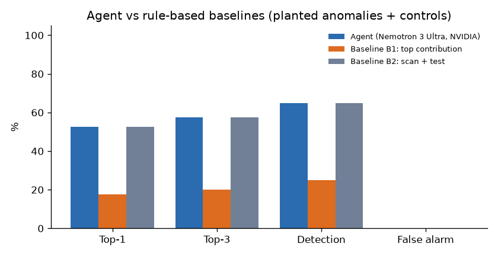
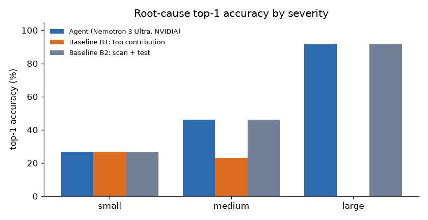
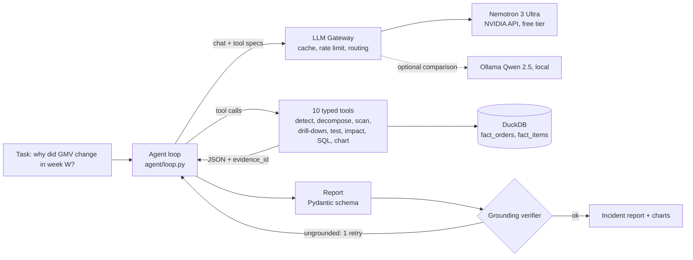

# KPI Root-Cause Agent

An LLM agent that investigates why a business KPI moved: it confirms the anomaly, decomposes the metric, scans every segment, tests significance and writes a short incident report in which every number is checked against a tool output.

**Highlights**

<!-- HIGHLIGHTS:START -->

- **52.5%** top-1 / **57.5%** top-3 root-cause accuracy on 40 planted anomalies, vs **17.5%** for a naive top-contribution rule.
- **99.31%** of report figures verified against cited tool outputs; **0%** false alarms on 10 anomaly-free control weeks.
- All LLM calls go through my LLM gateway: **100.0%** exact-cache hits (570 of 570 calls) when the full evaluation was rerun.

<!-- HIGHLIGHTS:END -->

[](https://github.com/nivi9944/kpi-rca-agent/actions/workflows/ci.yml)

[](LICENSE)

`LLM function calling` · `Pydantic` · `DuckDB` · `pandas` · `SciPy` / `statsmodels` · `Streamlit` · `pytest`

---

## Overview

When GMV, average order value or on-time delivery moves unexpectedly, an analyst has to find out which
segment caused it, whether the effect is real, and what it is worth. This project hands that investigation
to an LLM agent with a strict division of labour: **the LLM plans and explains, deterministic Python
computes.** The model chooses which of 10 typed tools to call, and every figure in its final report must
match a cited tool output, or the grounding verifier rejects it.

The data is the public [Olist Brazilian e-commerce dataset](https://www.kaggle.com/datasets/olistbr/brazilian-ecommerce):
98,353 real orders from 2017-01 to 2018-08, aggregated weekly. The agent is evaluated on 50 scenarios with
known answers (40 planted anomalies + 10 control weeks) and compared against two rule-based baselines.

**Model:** NVIDIA Nemotron 3 Ultra (`nvidia/nemotron-3-ultra-550b-a55b`, NVIDIA API catalog free tier,
thinking off), called through my [LLM API Gateway](https://github.com/nivi9944/llm-gateway). It was chosen
because the Gemini free tier allows only 20 requests per day and Mistral's free API returned a 0 requests/min
limit (details in [DECISIONS.md](DECISIONS.md)).

## Key results

| Metric | Agent (Nemotron 3 Ultra) | Baseline B2: scan + test | Baseline B1: top contribution | Source |
|---|---|---|---|---|
| Top-1 root-cause accuracy (40 planted) | 52.5% | 52.5% | 17.5% | `results/eval_summary.json`, `results/baseline_summary.json` |
| Top-3 root-cause accuracy | 57.5% | 57.5% | 20.0% | same |
| Detection recall | 65.0% | 65.0% | 25.0% | same |
| False-alarm rate (10 control weeks) | 0.0% | 0.0% | 0.0% | same |
| Grounding rate (report numbers verified) | 99.31% | n/a (no text) | n/a (no text) | `results/eval_summary.json` |
| Avg tool calls / tokens / latency per investigation | 9.96 / 72,574.38 / 127.09 s | 3.46 / none / 0.8 s | 2.0 / none / 0.06 s | same |
| Cost per investigation | $0 (free tier) | $0 | $0 | `results/eval_summary.json` |
| Gateway exact-cache hit rate on a full rerun | 100.0% (570 of 570 calls) | | | `results/cache_rerun.json` |
| Avg latency per investigation on the cached rerun | 75.66 s (first run 127.09 s) | | | `results/cache_rerun.json` |

**Reading the table honestly.** The agent uses the same scan and tests as B2, so it matches B2's
detection exactly and ties it on accuracy: it wins two scenarios B2 ranks wrongly (s22, s24) and loses
two B2 ranks correctly (s35, s36). What the agent adds over B2 is the part a rule cannot produce: a
readable incident report with business framing, R$ impact and actions, in which 99.31% of the figures are
machine-verified. Both are far ahead of the naive rule (B1). See [Failure analysis](#failure-analysis).




## Architecture



## How the agent investigates

The system prompt enforces a recipe, and the verifier checks the result:

1. `detect_anomalies`: robust z-score of the week's change vs the previous 4-week average, scored against the 8 trailing weekly changes (median/MAD).
2. `decompose_metric`: GMV = Orders x AOV, an exact log split.
3. `scan_segments`: every segment of every dimension scored against its own weekly history (share and rate), with a sampling-noise floor. This finds problems that are invisible in the total.
4. `drill_down`: contribution of each segment; for ratio metrics the exact split `delta = sum (w1 - w0)(r0 - R0) [mix] + sum w1 (r1 - r0) [rate]`, which separates Simpson-style mix shifts from real behaviour changes.
5. `significance_test`: chi-square on share, two-proportion z or Welch t on rate. A root cause must pass **Benjamini-Hochberg q <= 0.05 and |hist_z| >= 4.25**.
6. `estimate_impact`, optional `run_sql` (read-only, single statement, row and time limits) and `make_chart`, then `submit_report`.

The loop is bounded (12 tool calls, token budget, timeout), runs at temperature 0, validates the final
report against a Pydantic schema, and gives the model one corrective retry if the verifier finds a number
it cannot trace. Tool results are sent to the model as compact JSON; the verifier always checks against the
full stored evidence. Example reports: [mix shift](results/examples/s40_mix_shift_large_nvidia.md),
[delivery delay](results/examples/s22_delivery_delay_small_nvidia.md),
[control week](results/examples/s45_control_clean_nvidia.md).

## Evaluation

**Scenarios** (`inject/manifest.json`, fixed seeds): 6 anomaly types x 3 severities planted into real
weeks (volume drop, price drop, delivery delay, cancellation spike, review drop, mix shift), plus 5 clean
control weeks and 5 with 5% uniform random order loss. Severities are calibrated per type, and target weeks
avoid real events (Black Friday, the 2018 truckers' strike, the World Cup).

**Metrics:** top-1 (rank-1 cause matches dimension and segment, and effect type for mix/rate cases), top-3,
detection recall (anomaly confirmed), false-alarm rate (a control week reported with a root cause), and
grounding rate (share of report numbers found in cited tool outputs).

**Threshold calibration:** the segment-scan threshold was set on natural, un-planted weeks only
(`results/calibration.json`), never on the planted scenarios.

<!-- RESULTS:START -->
Scenarios: **40 planted anomalies + 10 controls** (inject/manifest.json). Source files: `results/eval_summary.json`, `results/baseline_summary.json`.

| Investigator | Top-1 | Top-3 | Detection recall | False alarms (controls) | Grounding | Avg tool calls | Avg tokens / run | Avg latency | Cost / run |
|---|---|---|---|---|---|---|---|---|---|
| Agent (Nemotron 3 Ultra, NVIDIA) | 52.5% | 57.5% | 65.0% | 0.0% | 99.31% | 9.96 | 72574.38 | 127.09 s | $0 (free tier) |
| Agent (Gemini Flash) (subset: 2 of 50 scenarios) | 100.0% | 100.0% | 100.0% | 0.0% | 100.0% | 8.5 | 66480.5 | 241.91 s | $0.0500 est. |
| Baseline B2: scan + test | 52.5% | 57.5% | 65.0% | 0.0% | n/a (no text) | 3.46 | n/a | 0.8 s | n/a |
| Baseline B1: top contribution | 17.5% | 20.0% | 25.0% | 0.0% | n/a (no text) | 2.0 | n/a | 0.06 s | n/a |

**Top-1 accuracy by scenario type and severity** (controls: false-alarm rate)

| Type | Severity | n | Agent (Nemotron 3 Ultra, NVIDIA) | Baseline B2: scan + test | Baseline B1: top contribution |
|---|---|---|---|---|---|
| volume_drop | large | 2 | 100.0% | 100.0% | 0.0% |
| volume_drop | medium | 3 | 33.3% | 33.3% | 0.0% |
| volume_drop | small | 3 | 0.0% | 0.0% | 33.3% |
| price_drop | large | 2 | 50.0% | 50.0% | 0.0% |
| price_drop | medium | 2 | 0.0% | 0.0% | 0.0% |
| price_drop | small | 3 | 0.0% | 0.0% | 0.0% |
| delivery_delay | large | 2 | 100.0% | 100.0% | 0.0% |
| delivery_delay | medium | 2 | 0.0% | 0.0% | 0.0% |
| delivery_delay | small | 3 | 33.3% | 0.0% | 33.3% |
| cancellation_spike | large | 2 | 100.0% | 100.0% | 0.0% |
| cancellation_spike | medium | 2 | 100.0% | 50.0% | 100.0% |
| cancellation_spike | small | 2 | 100.0% | 100.0% | 100.0% |
| review_drop | large | 2 | 100.0% | 100.0% | 0.0% |
| review_drop | medium | 2 | 100.0% | 100.0% | 50.0% |
| review_drop | small | 2 | 0.0% | 0.0% | 0.0% |
| mix_shift | large | 2 | 100.0% | 100.0% | 0.0% |
| mix_shift | medium | 2 | 50.0% | 100.0% | 0.0% |
| mix_shift | small | 2 | 50.0% | 100.0% | 0.0% |
| control_clean | none | 5 | 0.0% | 0.0% | 0.0% |
| control_noise | none | 5 | 0.0% | 0.0% | 0.0% |

Segment-scan threshold |hist_z| >= 4.25 was calibrated on 170 natural (un-planted) week x metric pairs: 8.2% natural alarm rate (`results/calibration.json`).
<!-- RESULTS:END -->

## Failure analysis

All figures below come from `results/runs/nvidia.jsonl` and `results/runs/baseline_scan.jsonl`.

**Mix shifts s35 and s36 (agent wrong, B2 right).** The agent found the true cause with the correct *mix*
label but ranked it second. In s35 the scan and tests ranked `product_category = telephony` strongest
(hist_z 5.5545, q 4.105e-23), yet the agent put `is_repeat_customer = 0` (rate, hist_z -4.411, q 0.02035)
first. In s36 `electronics` was far stronger (hist_z 19.7654, q 2.765e-87) than `seller_state = PR`
(hist_z 9.2094), which the agent ranked first and labelled *rate* although its test was a share (mix) test.
The failure is ranking by narrative plausibility instead of evidence strength, not a wrong effect label.
Mix-shift top-3 is 100% for the agent at every severity.

**Price drops (hard for both).** A price cut inside one category barely moves the headline AOV (s14: a 50%
cut in `auto`, headline change -0.1479%) and does not make the category unusual against its own noisy
history (s10: `health_beauty` hist_z -1.76; s13: `sports_leisure` hist_z -2.8831, below the 4.25 threshold).
Both the agent and B2 get only s11 (a large drop) right; by severity their price-drop top-1 is 50% (large) and 0% (medium, small).

**Where the agent beat B2 (s22, s24).** In s22 (small delivery delay) B2 ranked a `garden_tools` mix effect
first; the agent ranked `seller_state = SP` (rate), the true cause, first. In s24 (cancellation spike) B2
ranked `customer_state = SP` first; the agent ranked the true `main_payment_type = credit_card` first.

**Ungrounded reports (6 of 50).** No invented figures were found. Three reports wrote a p-value as
"p < 0.001", a threshold that does not appear in any tool output; three quoted a value the model derived
itself (a difference of two tool values in s31, a percentage change in s36, a sum of contributions in s37).
All six had already used their corrective retry; five were still top-1 correct.

## Real-world case study

Not part of the score (`results/case_study.json`):

- **2018 Brazilian truckers' strike (week of 2018-05-21):** GMV fell 48.7308% vs the prior 4 weeks
  (z -25.694), and 96.9752% of the drop came from fewer orders. No single segment passed the tests: the drop
  was broad, with RJ (-67.2601%) and MG (-53.9815%) falling harder than SP (-32.0423%).
- **Black Friday 2017 (week of 2017-11-20):** GMV rose 165.12%, while the on-time delivery rate fell from 0.9456
  to 0.8274 as delivered orders rose 172.62%.

## Expectations vs results

| Requirement or expectation | Expected | Actual | Status | Evidence |
|---|---|---|---|---|
| Numbers only from tools, enforced by a verifier | Verifier on every report | 99.31% of figures verified; 6 reports flagged, none invented | Met | `results/eval_summary.json` |
| Beat the naive baseline | Higher accuracy than top-contribution rule | 52.5% vs 17.5% top-1 | Met | `results/baseline_summary.json` |
| Advantage on mix-shift cases | Better than baseline | Top-1 100% / 50% / 50% (large / medium / small), top-3 100% at every severity; B2 100% top-1, B1 0% | Partly met | `results/eval_by_type.csv` |
| Advantage on downstream effects (delay then reviews) | Better than baseline | No scenario plants a chained effect | Not measured | `inject/manifest.json` |
| Correctly say "nothing found" on controls | Low false-alarm rate | 0.0% on 10 controls | Met | `results/eval_summary.json` |
| Readable narrative with business framing and actions | Every report | Narrative, R$ impact and actions in every agent report | Met | `results/examples/` |
| Reproducible, resumable, rate-limit aware evaluation | Temperature 0, fixed seeds, JSONL checkpoints | Full rerun answered 100.0% from the exact cache; 0 failed runs | Met | `results/cache_rerun.json` |
| Safe SQL, bounded agent, tested tools, CI | All in place | Read-only SQL guard, step cap, token budget, timeout; unit tests in CI | Met | `tools/sql_guard.py`, `tests/` |

## Design decisions

The main choices, each with its reason, are in [DECISIONS.md](DECISIONS.md). In short: an own agent loop
with plain OpenAI-style function calling (no framework); a Pydantic report schema submitted through a tool;
median/MAD anomaly scoring against the change history; an exact mix vs rate split; significance with
Benjamini-Hochberg correction plus a history check calibrated on natural weeks; every run forced to one
provider through the gateway so no run mixes models.

## Run it in 3 commands

```powershell
pip install -r requirements.txt
python -m data.load_olist                  # put the Kaggle zip (or CSVs) in data/raw first
streamlit run app/streamlit_app.py         # demo: pick a scenario or a real week
```

Evaluation: `python -m eval.run --model baseline_scan`, `python -m eval.run --model nvidia` (needs the
gateway with an `NVIDIA_API_KEY`), then `python -m eval.report_tables` and `python -m eval.readme`. Runs are
resumable (one JSONL line per scenario) and throttled for free-tier limits. Tests:
`python -m pytest -q` (synthetic fixture with hand-computed answers; no data or key needed).

## Project structure

| Folder | What it holds |
|---|---|
| `data/` | CSV to DuckDB build: `fact_orders`, `fact_items` |
| `metrics/` | Metric catalog (each metric defined once) and the metric engine |
| `tools/` | Analysis tools, SQL guard, charts, tool registry (typed schemas) |
| `inject/` | Anomaly injector and the 50-scenario manifest (fixed seeds) |
| `agent/` | Loop, prompts, report schema, grounding verifier, compact tool view, LLM client |
| `baseline/` | Two deterministic baselines |
| `eval/` | Runner, scoring, tables and charts, README results, threshold calibration, case study |
| `app/` | Streamlit demo |
| `results/` | Every reported number: summaries, per-type CSV, charts, example reports, run logs |
| `tests/` | Unit tests for tools, verifier, SQL guard, scoring and the agent loop (scripted fake LLM) |

## Limitations and future work

- Anomalies are **synthetic** (planted into real data): clean, single-cause, one-week events. Real incidents are messier.
- Olist has **no traffic data**, so there is no visit-to-purchase conversion funnel. One marketplace, one currency (R$), weekly grain only.
- The segment-scan threshold trades recall for a low false-alarm rate; small effects in small segments are often missed (see the severity table).
- The agent ranks candidates by plausibility rather than evidence strength in some mix-shift cases; ranking by the test statistics is the next improvement.
- The model runs on a free tier with no list price, so cost is reported as $0 with tokens per run. A full evaluation takes about two hours under the rate limits.
- Two early smoke-test rows from Gemini Flash remain in `results/runs/gemini.jsonl`; they are labelled as a subset and are not a result.

## Licence

Code: MIT. Data: Olist, CC BY-NC-SA 4.0 (non-commercial); this repository contains code and results only,
download the data from Kaggle.
